# The DOM (Document Object Model) — A Complete Guide

> **Course:** Web Development — Semester II (React JS Track)
> **Topic:** The Document Object Model — concept, node types, accessing & manipulating elements
> **Prerequisites:** HTML, CSS, JavaScript fundamentals (variables, functions, arrays, loops, events)

---

## Table of Contents

1. [What is the DOM?](#1-what-is-the-dom)
2. [Document + Object + Model](#2-document--object--model)
3. [How the DOM Works](#3-how-the-dom-works)
4. [The DOM Tree & Node Types](#4-the-dom-tree--node-types)
5. [The `$0` Debugging Variable](#5-the-0-debugging-variable)
6. [Accessing DOM Elements](#6-accessing-dom-elements)
7. [Manipulating DOM Elements](#7-manipulating-dom-elements)
8. [Why the DOM Matters](#8-why-the-dom-matters)
9. [Looking Ahead: DOM → React](#9-looking-ahead-dom--react)
10. [Project: ToDo List](#10-project-build-a-todo-list)
11. [Quick Reference Cheat Sheet](#11-quick-reference-cheat-sheet)

---

## 1. What is the DOM?

When a browser loads an HTML file, it doesn't just paint text on the screen. It first reads your HTML and builds a **living model of the page in memory** — a structured map of every tag, attribute, and piece of text. That model is the **Document Object Model**, or **DOM**.

> ### 🧠 Mental Model: The Building Blueprint
>
> Think of your HTML file as the **architect's blueprint** — a flat sheet of paper describing a building. The DOM is the **actual 3D model** the browser constructs from that blueprint: rooms you can walk into, doors you can open, lights you can switch on and off.
>
> You don't edit the building by erasing lines on the paper. You walk in and *interact with the real thing*. JavaScript edits the page the same way — not by rewriting the HTML file, but by reaching into the live DOM and changing it.

The DOM is three things at once:

| It is a... | Meaning |
|------------|---------|
| **Programming interface** | A set of objects, properties, and methods JavaScript can call |
| **Modification assistant** | It lets you change structure, content, and style *after* the page has loaded |
| **Structure provider** | It represents the page as an organized, navigable tree |

**In one sentence:** *The DOM is a programming interface that lets JavaScript read and modify a web page's structure, content, and style while it's running in the browser.*

---

## 2. Document + Object + Model

The name itself explains the concept. Break it into three words:

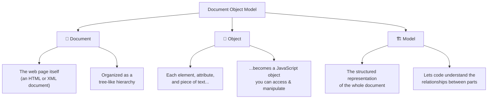

- **Document** → the web page. Every HTML page you open *is* a document.
- **Object** → every part of that page (a heading, a link, an attribute like `href`, even the text inside a tag) is turned into an object that JavaScript can touch.
- **Model** → the organized, structured arrangement that ties all those objects together so they can be navigated as a whole.

---

## 3. How the DOM Works

The DOM doesn't exist on disk. It's **built fresh by the browser every time the page loads.**

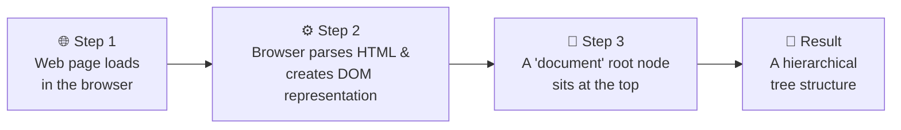

Once that tree exists, JavaScript can walk it, read from it, and change it — and the browser instantly re-renders the visible page to match.

### From HTML to Tree

Here's the key idea that makes everything else click. This HTML:

```html
<!DOCTYPE html>
<html>
<head>
    <title>Demo Example</title>
</head>
<body>
    <div>
        <a href="https://www.demo.com">Click Here</a>
        <h1>Heading Tag</h1>
    </div>
</body>
</html>
```

...becomes this tree in memory:

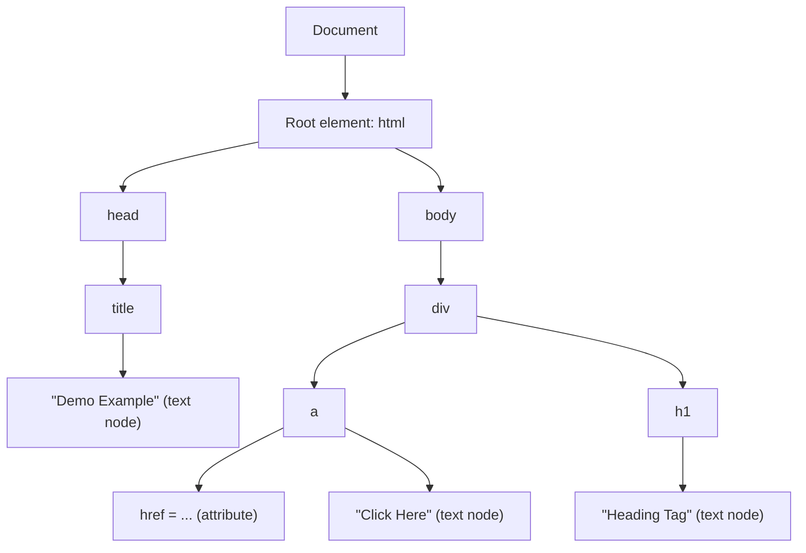

Notice three different *kinds* of things on the tree: **elements** (`div`, `a`, `h1`), **attributes** (`href`), and **text nodes** (the actual words). These are called **node types**, and they're next.

---

## 4. The DOM Tree & Node Types

Everything in the DOM tree is a **node**. But not all nodes are the same — there are several types, each representing a different part of your document.

> ### 🧠 Mental Model: A Family Tree
>
> The DOM is a family tree. The `document` is the great-ancestor at the top. Elements are family members. Each member can have children (nested elements), text (their "name"), and attributes (their "traits"). Everyone is a **node** — they just play different roles.

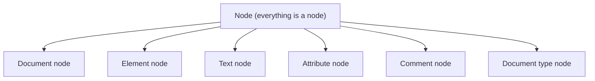

We'll explore each using a single example page. Imagine this HTML is loaded in the browser:

```html
<!DOCTYPE html>
<html>
<head>
    <title>DOM Node Types Example</title>
</head>
<body>
    <div id="myDiv" class="example">
        <p>This is a paragraph</p>
        <!-- This is a comment -->
        <a href="https://www.example.com">Click me</a>
    </div>
</body>
</html>
```

### 4.1 Document Node

Represents the **entire HTML document** — the root of the whole tree. Every other node lives underneath it.

```js
var documentNode = document;
console.log(documentNode);
// Logs the whole document object
```

### 4.2 Element Node

Represents an **HTML element** (a tag) like `<p>`, `<div>`, or `<a>`. This is the type you'll work with most often.

```js
// If <p>This is a paragraph</p> is the selected element:
$0
// Output: <p>This is a paragraph</p>
```

### 4.3 Text Node

Represents the **text content** inside an element. The words "This is a paragraph" are a separate node from the `<p>` element that holds them.

```js
$0.textContent
// Output: "This is a paragraph"
```

### 4.4 Attribute Node

Represents an element's **attributes** — extra information like `href`, `id`, `class`, or `src`. Attributes provide additional details about an element.

```js
// Read an attribute
$0.getAttribute("href");
// Output: 'https://www.example.com'

// Change an attribute
$0.setAttribute("href", "https://www.newexample.com");

// Read it again to confirm the update
$0.getAttribute("href");
// Output: 'https://www.newexample.com'
```

### 4.5 Comment Node

Represents an **HTML comment** (`<!-- ... -->`). Comments are part of the DOM too, even though they aren't visible on the page. To reach one, you first grab its parent element, then dig into its child nodes.

```js
// 1. Get a reference to the parent element
var divElement = document.getElementById('myDiv');

// 2. Access the comment node among its children
var commentNode = divElement.childNodes[3]; // <!-- This is a comment -->

// 3. Read the comment's content
var commentContent = commentNode.nodeValue;
// Output: ' This is a comment '
```

### 4.6 Document Type Node

Represents the **document type declaration** — the `<!DOCTYPE html>` line at the very top of your file.

```js
// With <!DOCTYPE html> selected:
$0.nodeType
// Output: 10   (10 is the node-type number for a DocumentType node)
```

### Node Types at a Glance

| Node Type | Represents | Example | How to access |
|-----------|-----------|---------|---------------|
| **Document** | The whole page | the page itself | `document` |
| **Element** | An HTML tag | `<p>`, `<div>` | `$0`, `getElementById(...)` |
| **Text** | Text inside a tag | "This is a paragraph" | `$0.textContent` |
| **Attribute** | Extra info on a tag | `href`, `id`, `class` | `$0.getAttribute("href")` |
| **Comment** | An HTML comment | `<!-- note -->` | `node.nodeValue` |
| **Document type** | The doctype line | `<!DOCTYPE html>` | `$0.nodeType` → `10` |

---

## 5. The `$0` Debugging Variable

Before writing scripts, it helps to *poke at* the DOM by hand. The browser gives you a special shortcut for this: **`$0`**.

> ### 🧠 Mental Model: "This One Right Here" 👆
>
> `$0` is the console's way of saying *"the element I'm currently pointing at."* You click an element in the inspector, and `$0` becomes a live handle to it — no need to write a selector. It's a pointer you control with your mouse.

**What `$0` is:**
- A special variable available **in the browser's developer console**
- It references the **element currently selected** in the Elements panel
- Used for **debugging and inspecting** elements quickly — *not* for production code

**How to use it:**

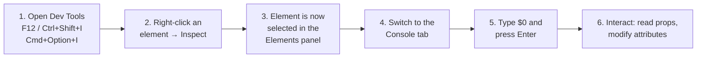

Once you have `$0`, you can try everything from Section 4 live:

```js
$0                          // the selected element
$0.textContent              // its text
$0.getAttribute("href")     // an attribute value
$0.setAttribute("href", "https://www.newexample.com")  // change it
$0.nodeType                 // its node-type number
```

This is the fastest way to *experiment* with the DOM before committing it to a script.

---

## 6. Accessing DOM Elements

To change anything on a page with JavaScript, you follow three steps every single time:

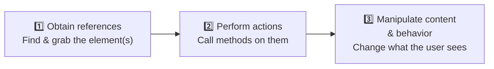

Step 1 — *obtaining a reference* — is what this section is about. There are four core methods.

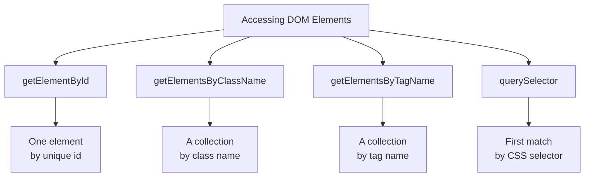

### 6.1 `getElementById`

Accesses **one** HTML element using its **unique `id`**. Because IDs are unique, you get back a single element.

```html
<h1 id="main-heading">Welcome to the Example Page</h1>
<p id="content-paragraph">This is some content.</p>

<script>
  // Access the element with the id "main-heading"
  const headingElement = document.getElementById('main-heading');
  console.log(headingElement);
  // Logs: <h1 id="main-heading">Welcome to the Example Page</h1>
</script>
```

**Use case:** grabbing one specific, known element — a form, a single button, a container you've given an ID.

### 6.2 `getElementsByClassName`

Accesses **multiple** HTML elements that share the **same class name**. It returns a *collection*, so you loop over it to work with each element.

```html
<p class="highlighted">Paragraph one.</p>
<p class="highlighted">Paragraph two.</p>
<p>This is a regular paragraph.</p>

<script>
  // Access all elements with class "highlighted"
  const highlightedElements = document.getElementsByClassName('highlighted');

  // Modify the text content of each element
  for (let i = 0; i < highlightedElements.length; i++) {
    highlightedElements[i].textContent = 'This paragraph is highlighted!';
  }
</script>
```

**Use case:** applying the same change to many elements — all error messages, all cards, all highlighted items.

> ⚠️ **Note the plural — `getElement*s*ByClassName`.** It returns a *collection*, not a single element. You can't call `.textContent` on the collection directly; you must loop or index into it (`[0]`, `[1]`, ...).

### 6.3 `getElementsByTagName`

Accesses **multiple** HTML elements based on their **tag name** (`p`, `div`, `li`, ...). It returns an **HTMLCollection**.

```html
<p>This is a paragraph.</p>
<p>This is another paragraph.</p>

<script>
  // Access all <p> elements
  const paragraphElements = document.getElementsByTagName('p');
  console.log(paragraphElements);     // the whole collection
  console.log(paragraphElements[0]);  // first <p>
  console.log(paragraphElements[1]);  // second <p>
</script>
```

The console output looks like this:

```
▼ HTMLCollection(2) [p, p]
    0: p
    1: p
    length: 2
```

**Use case:** working with every element of a kind — all list items, all images, all paragraphs.

### 6.4 `querySelector`

Accesses elements using **CSS-like selectors** — the same syntax you already know from styling. It returns the **first** element that matches.

```html
<p class="highlighted">This is a highlighted paragraph.</p>
<p id="my-paragraph">This is a paragraph with an ID.</p>
<div>This is a regular paragraph.</div>

<script>
  // Select by class (note the dot, just like CSS)
  const elementByClass = document.querySelector('.highlighted');
  console.log(elementByClass);

  // Select by ID (note the hash, just like CSS)
  const elementByID = document.querySelector('#my-paragraph');
  console.log(elementByID);

  // Select by tag — returns the FIRST match
  const elementByTag = document.querySelector('div');
  console.log(elementByTag);
</script>
```

**Use case:** the modern, flexible default. One method handles IDs (`#id`), classes (`.class`), tags (`tag`), and complex selectors (`div.card > p:first-child`).

### Choosing the Right Method

| Method | Selects by | Returns | When to use |
|--------|-----------|---------|-------------|
| `getElementById` | `id` | **One** element | You know the exact unique element |
| `getElementsByClassName` | class | **Collection** | Many elements sharing a class |
| `getElementsByTagName` | tag name | **HTMLCollection** | Every element of one tag type |
| `querySelector` | **any CSS selector** | **First** match | Flexible, modern, all-purpose |

> 💡 **For the React track:** `querySelector` is the one to internalize. Its CSS-selector style is the most flexible, and the mental shift from "manually grabbing elements" to "describing what you want" is exactly the thinking React builds on.

---

## 7. Manipulating DOM Elements

Once you hold a reference to an element, you can change it. Manipulation means making changes to one of four things:

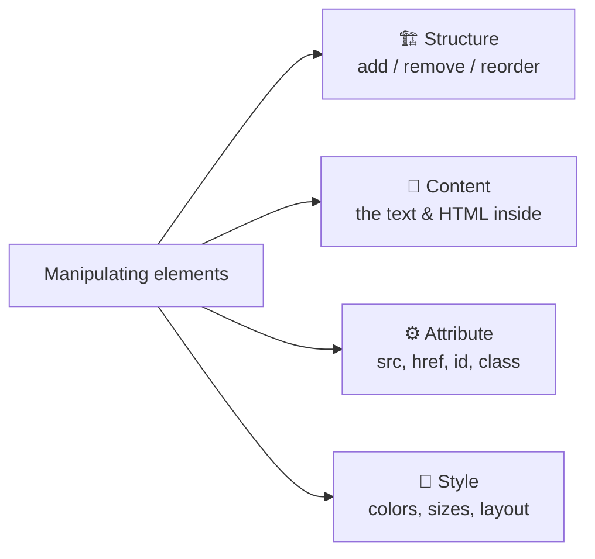

### 7.1 Changing Content

Use `.textContent` to replace the text inside an element.

```html
<p id="my-paragraph">This is some text.</p>

<script>
  const paragraph = document.getElementById('my-paragraph');
  paragraph.textContent = 'This is updated text.';
</script>
```

**Result:** the paragraph on the page now reads "This is updated text."

### 7.2 Changing Attributes

Use `.setAttribute(name, value)` to change an element's attributes — which can affect its behavior *and* appearance.

```html


<script>
  const image = document.getElementById('my-image');
  image.setAttribute('src', 'new-image.jpg');
</script>
```

**Result:** the page now displays `new-image.jpg` instead of the old one.

### 7.3 Adding & Removing Elements

Build new elements with `document.createElement(...)` and attach them with `.appendChild(...)`. This is how pages grow in response to user actions.

```html
<ul id="my-list">
    <li>Item 1</li>
    <li>Item 2</li>
</ul>

<script>
  const list = document.getElementById('my-list');
  const newItem = document.createElement('li');  // create a new <li>
  newItem.textContent = 'Item 3';                // give it text
  list.appendChild(newItem);                     // attach it to the list
</script>
```

**Result:** the list now has three items.

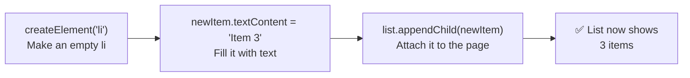

### 7.4 Handling Events

Use `.addEventListener(type, callback)` to **respond to user interactions** — clicks, typing, hovering, and more.

```html
<button id="my-button">Click me</button>

<script>
  const button = document.getElementById('my-button');
  button.addEventListener('click', function () {
    alert('Button clicked!');
  });
</script>
```

**Result:** clicking the button pops up an alert.

> ### 🧠 Mental Model: A Doorbell 🔔
>
> `addEventListener` is like installing a doorbell. You wire it up *once* ("when someone presses this button..."), and from then on it just waits. Every time the event happens, your function ("...ring the bell") runs automatically. You don't keep checking the door — the listener does it for you.

### 7.5 Reordering Elements

Change the display order of elements with `.insertBefore(...)`.

```html
<div id="my-container">
    <p>First paragraph</p>
    <p>Second paragraph</p>
</div>

<script>
  const container = document.getElementById('my-container');
  const secondParagraph = container.querySelector('p:nth-child(2)');
  container.insertBefore(secondParagraph, container.querySelector('p'));
</script>
```

**Result:** the second paragraph now appears before the first.

### 7.6 Cloning Elements

Copy an existing element with `.cloneNode(true)`. Passing `true` makes a *deep* copy — the element and everything inside it.

```html
<ul id="my-list">
    <li>Item 1</li>
    <li>Item 2</li>
</ul>

<script>
  const list = document.getElementById('my-list');
  const firstItem = list.querySelector('li');
  const clonedItem = firstItem.cloneNode(true);  // deep copy
  list.appendChild(clonedItem);
</script>
```

**Result:** the list gains a third item identical to the first.

### Manipulation Methods at a Glance

| Goal | Method / Property | Example |
|------|-------------------|---------|
| Change text | `.textContent` | `el.textContent = 'Hi'` |
| Change attribute | `.setAttribute()` | `el.setAttribute('src', 'a.jpg')` |
| Create element | `document.createElement()` | `document.createElement('li')` |
| Add element | `.appendChild()` | `list.appendChild(item)` |
| Respond to events | `.addEventListener()` | `btn.addEventListener('click', fn)` |
| Reorder | `.insertBefore()` | `parent.insertBefore(a, b)` |
| Copy | `.cloneNode(true)` | `el.cloneNode(true)` |

---

## 8. Why the DOM Matters

The DOM is what turns a static document into a real application. Without it, a web page would be a frozen poster. With it, the page can respond, update, and adapt.

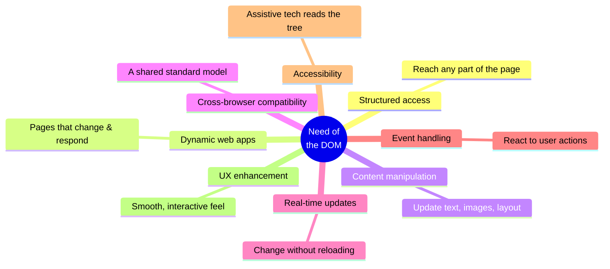

Developers leverage the DOM to **access and modify page content**, **build dynamic and interactive features**, and **respond to user interactions** — all the things that make a website feel like software rather than a printout.

---

## 9. Looking Ahead: DOM → React

Everything above is **imperative** — you give the browser step-by-step commands: *find this element, change its text, append that child, wire up this listener.* You're the one managing every update by hand.

Keep this experience in mind, because **React exists to solve the pain points you're about to feel.** When you build the ToDo List below, watch how much manual work goes into:

- finding elements every time something changes,
- creating and appending nodes one by one,
- keeping the screen in sync with your data.

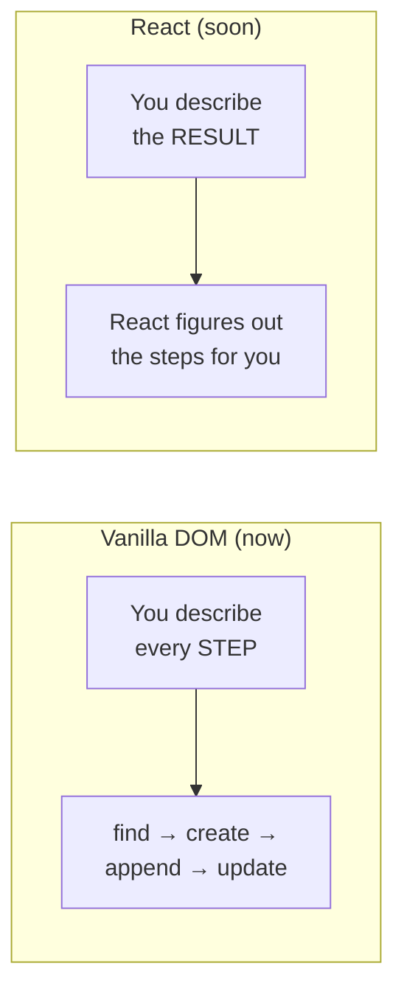

The shift from **"how to update the page step by step"** (DOM) to **"what the page should look like for this data"** (React) is the single biggest idea in the React track. You can't appreciate the solution without first feeling the problem — so build the project the hard way, on purpose.

---

## 10. Project: Build a ToDo List

Time to use everything: accessing elements, changing content, creating and removing nodes, and handling events — all in one small, complete app that runs in any browser with **no setup, no build tools.**

### What we're building

A working ToDo list where you can:
- Type a task and add it to the list (**create + append**)
- Mark a task done by clicking it (**event handling + style**)
- Delete a task (**remove**)
- Clear all completed tasks at once (**access collection + remove**)

### The starter HTML

This is the structure (matching the slide). Save it as `index.html`.

```html
<!DOCTYPE html>
<html>
<head>
    <title>ToDo List</title>
</head>
<body>
    <h1>ToDo List</h1>
    <input type="text" id="taskInput" placeholder="Add a new task">
    <button id="addTaskBtn">Add Task</button>

    <!-- <input type="text" id="searchInput" placeholder="Search..."> -->
    <ul id="taskList">
        <!-- Tasks will be displayed here -->
    </ul>

    <button id="clearCompletedBtn">Clear Completed</button>

    <!-- Our JavaScript goes here -->
    <script src="script.js"></script>
</body>
</html>
```

Notice the four IDs we'll target: `taskInput`, `addTaskBtn`, `taskList`, and `clearCompletedBtn`. These are our handles into the DOM.

### How the app flows

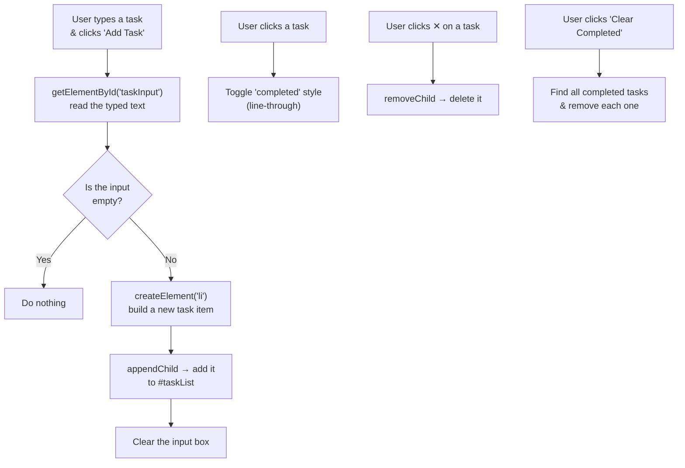

### The JavaScript — built in stages

We add complexity only after each step works. Save this as `script.js`.

#### Stage 1 — Add a task

First, get references to the elements we need, then wire up the Add button.

```js
// ---- Stage 1: Adding tasks ----

// 1. Obtain references to the elements (Accessing the DOM)
const taskInput = document.getElementById('taskInput');
const addTaskBtn = document.getElementById('addTaskBtn');
const taskList = document.getElementById('taskList');

// 2. A function that creates one task and adds it to the list
function addTask() {
  const taskText = taskInput.value.trim();   // read what the user typed

  // Guard clause: ignore empty input
  if (taskText === '') {
    return;
  }

  // Create a new <li> element (Manipulating: creating)
  const li = document.createElement('li');
  li.textContent = taskText;

  // Add it to the list (Manipulating: appending)
  taskList.appendChild(li);

  // Reset the input box so it's ready for the next task
  taskInput.value = '';
}

// 3. Run addTask when the button is clicked (Handling events)
addTaskBtn.addEventListener('click', addTask);
```

✅ **Test it:** type a task, click "Add Task", and watch it appear. This already uses *accessing*, *creating*, *appending*, and *event handling*.

#### Stage 2 — Mark a task as completed

Let clicking a task toggle a "done" look. We'll add a tiny bit of inline style so there's no separate CSS file to manage.

```js
// ---- Stage 2: Mark a task complete by clicking it ----

// Inside addTask(), after creating the li, add a click listener:
li.addEventListener('click', function () {
  // Toggle a line-through style each time it's clicked
  if (li.style.textDecoration === 'line-through') {
    li.style.textDecoration = 'none';
    li.style.color = 'black';
  } else {
    li.style.textDecoration = 'line-through';
    li.style.color = 'gray';
  }
});
```

✅ **Test it:** click a task — it gets crossed out. Click again — it comes back. This is *event handling* + *style manipulation*.

#### Stage 3 — Delete a single task

Give every task a small delete button.

```js
// ---- Stage 3: Delete a single task ----

// Inside addTask(), after creating the li, build a delete button:
const deleteBtn = document.createElement('button');
deleteBtn.textContent = '✕';
deleteBtn.style.marginLeft = '10px';

// When the ✕ is clicked, remove this task from the list
deleteBtn.addEventListener('click', function (event) {
  event.stopPropagation();      // don't also trigger the li's click (Stage 2)
  taskList.removeChild(li);     // remove the task (Manipulating: removing)
});

// Attach the button to the task
li.appendChild(deleteBtn);
```

> 💡 `event.stopPropagation()` stops the click from "bubbling up" to the `<li>` and accidentally toggling the completed style. A small but real lesson in how events travel.

✅ **Test it:** each task now has a ✕ that deletes just that task.

#### Stage 4 — Clear all completed tasks

Use the "Clear Completed" button to remove every crossed-out task at once. This shows *accessing a collection* and looping to remove.

```js
// ---- Stage 4: Clear all completed tasks ----

const clearCompletedBtn = document.getElementById('clearCompletedBtn');

clearCompletedBtn.addEventListener('click', function () {
  // Get all tasks (a live collection of <li> elements)
  const tasks = taskList.getElementsByTagName('li');

  // Loop BACKWARDS — removing items shifts the collection,
  // so going forward would skip elements.
  for (let i = tasks.length - 1; i >= 0; i--) {
    if (tasks[i].style.textDecoration === 'line-through') {
      taskList.removeChild(tasks[i]);
    }
  }
});
```

> ⚠️ **Why loop backwards?** `getElementsByTagName` returns a *live* collection — it updates the instant you remove something. If you looped forward, removing item 0 would shift item 1 into its place and your index would skip it. Looping from the end avoids the problem. (Another future React talking point: React removes this whole class of bug.)

✅ **Test it:** mark a few tasks done, then click "Clear Completed" — only the crossed-out ones disappear.

### The complete `script.js`

Here's everything assembled into one file:

```js
// ===== ToDo List — full script =====

// --- Accessing the DOM: grab our elements once, up front ---
const taskInput = document.getElementById('taskInput');
const addTaskBtn = document.getElementById('addTaskBtn');
const taskList = document.getElementById('taskList');
const clearCompletedBtn = document.getElementById('clearCompletedBtn');

// --- Add a new task ---
function addTask() {
  const taskText = taskInput.value.trim();
  if (taskText === '') {
    return; // ignore empty input
  }

  // Create the task item
  const li = document.createElement('li');
  li.textContent = taskText;

  // Click the task to toggle "completed"
  li.addEventListener('click', function () {
    if (li.style.textDecoration === 'line-through') {
      li.style.textDecoration = 'none';
      li.style.color = 'black';
    } else {
      li.style.textDecoration = 'line-through';
      li.style.color = 'gray';
    }
  });

  // A delete button for this task
  const deleteBtn = document.createElement('button');
  deleteBtn.textContent = '✕';
  deleteBtn.style.marginLeft = '10px';
  deleteBtn.addEventListener('click', function (event) {
    event.stopPropagation();   // don't toggle completed when deleting
    taskList.removeChild(li);
  });

  li.appendChild(deleteBtn);
  taskList.appendChild(li);

  taskInput.value = ''; // reset input
}

// --- Wire up the buttons ---
addTaskBtn.addEventListener('click', addTask);

// Bonus: let the Enter key add a task too
taskInput.addEventListener('keypress', function (event) {
  if (event.key === 'Enter') {
    addTask();
  }
});

// --- Clear all completed tasks ---
clearCompletedBtn.addEventListener('click', function () {
  const tasks = taskList.getElementsByTagName('li');
  for (let i = tasks.length - 1; i >= 0; i--) {
    if (tasks[i].style.textDecoration === 'line-through') {
      taskList.removeChild(tasks[i]);
    }
  }
});
```

### Which concepts did we use?

| Concept from this guide | Where it appears in the project |
|-------------------------|----------------------------------|
| `getElementById` | Grabbing input, buttons, and list |
| `getElementsByTagName` | Finding all tasks to clear |
| `createElement` | Building each new `<li>` and ✕ button |
| `appendChild` | Adding tasks and buttons to the page |
| `removeChild` | Deleting tasks |
| `.textContent` | Setting task text |
| `.style` | Crossing out completed tasks |
| `addEventListener` | Add, click-to-complete, delete, clear, Enter key |
| `event.stopPropagation` | Stopping the delete click from toggling complete |

### Challenge extensions (try these!)

1. **Task counter** — show "3 tasks remaining" and update it on every change.
2. **Search/filter** — uncomment the `searchInput` in the HTML and hide tasks that don't match what's typed.
3. **Edit a task** — double-click a task to make its text editable.
4. **Empty state** — show "No tasks yet!" when the list is empty.
5. **Prevent duplicates** — refuse to add a task that already exists.

> 🔮 As your list grows, you'll notice the code gets harder to keep organized — every feature means more manual DOM updates. Hold that thought. That exact friction is what React was built to remove, and it's where we go next.

---

## 11. Quick Reference Cheat Sheet

### Accessing elements

```js
document.getElementById('id')              // one element by id
document.getElementsByClassName('class')   // collection by class
document.getElementsByTagName('tag')       // collection by tag
document.querySelector('.css-selector')    // first match (any CSS selector)
document.querySelectorAll('.css-selector') // all matches (bonus method)
```

### Reading & changing content/attributes

```js
el.textContent                       // read or set text
el.getAttribute('href')              // read an attribute
el.setAttribute('href', 'newURL')    // set an attribute
el.style.color = 'red'               // set a style
```

### Creating, adding, removing

```js
document.createElement('li')   // create a new element
parent.appendChild(child)      // add a child to the end
parent.removeChild(child)      // remove a child
parent.insertBefore(new, ref)  // insert before a reference element
el.cloneNode(true)             // deep-copy an element
```

### Events

```js
el.addEventListener('click', function () { /* ... */ });
el.addEventListener('keypress', function (e) { /* e.key */ });
event.stopPropagation();   // stop the event bubbling to parents
```

### Console debugging

```js
$0                 // the element selected in the Elements panel
$0.textContent     // its text
$0.nodeType        // its node-type number
console.log(x)     // print anything to the console
```

---

*End of guide. Next stop: React — where you describe* what *the page should be, and let the framework handle* how *to build it.*
